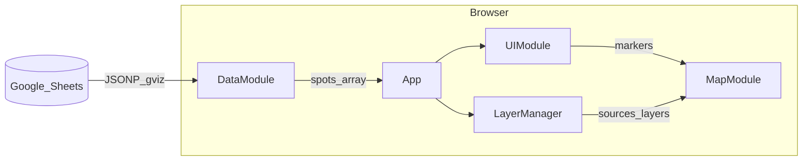

# アーキテクチャ概要

対象実装: [`map/index.html`](../map/index.html)（単一 HTML、ビルド不要）

---

## 1. モジュール構成

| モジュール | 役割 |
|------------|------|
| **CONFIG** | Mapbox トークン、`SHEET_ID`、列インデックス `COLS`、イラストマップ地理参照 `MAP_IMAGE`、ポーリング間隔、翻訳文言 |
| **DataModule** | Google Sheets `gviz` JSONP 取得、`_parse`、差分ハッシュ、ポーリング、`?refresh=1` 時の強制再取得 |
| **LayerManager** | 店舗ピン / ルート / エリア等の表示定義と GeoJSON ソース登録、トグル |
| **MapModule** | Mapbox 初期化（`empty-v9` + `CONFIG.MAP_IMAGE.url` の画像ソース）、フィット bounds、GPS、bearing / pitch |
| **UIModule** | カテゴリ／タグフィルター・レイヤーパネル・マーカー DOM・カード・モーダル（画像スライダー）・ティッカー・サイドバー折りたたみ（toggleSidebar） |
| **App** | 言語切替、カテゴリ選択、スポット選択、データ到着後の UI 更新 |

---

## 2. データフロー

---

## 3. 地図表示

- **ベーススタイル**: `mapbox://styles/mapbox/empty-v9`（地物なし）
- **イラスト**: `CONFIG.MAP_IMAGE` の `url`（既定は `300.png`）を `image` ソースで貼り付け、`coordinates` で四隅を WGS84 に対応。`latOffset` / `lngOffset` で画像とピンの微調整
- **カメラ**: `bearing` / `pitch` / `initZoom` で初期視点を調整
- **パン制限**: `maxBounds` でイラスト周辺に制限

---

## 4. 拡張ポイント

- **新列**: `CONFIG.COLS` と `DataModule._parse`、表示（モーダル等）を追加
- **ルート・エリア**: `LayerManager.setData('routes', geojson)` 等で GeoJSON を注入
- **分割ファイル化**: 現状は同一 HTML 内の論理分割。必要に応じて `js/` に分割してビルドを導入可能
